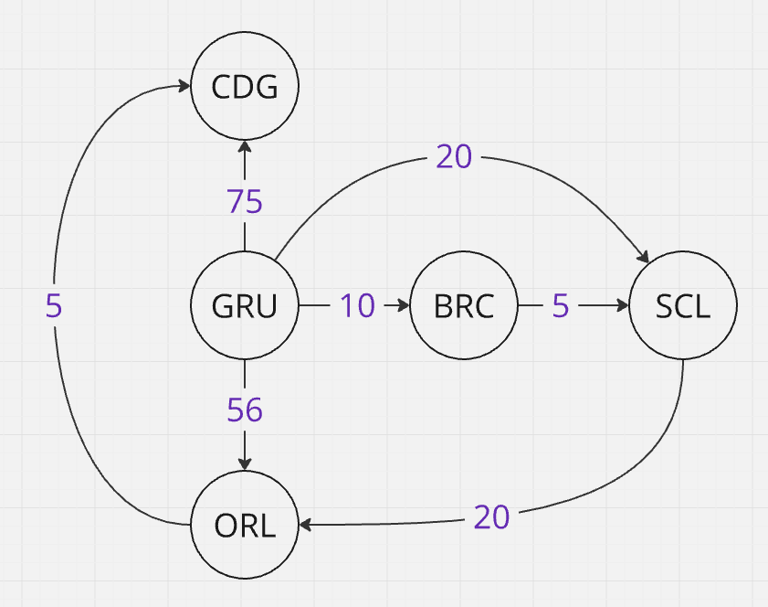

# RotasDeViagemAPI

Esse projeto consiste em uma API REST que visa calcular rotas de viagem pelo melhor preço, a partir de uma base configurável de conexões.

## Estrutura

Para a estrutura, eu decidi seguir com uma abordagem de arquitetura limpa, separando os módulos da API em 4 camadas distintas:

* **API** - Camada de comunicação com o cliente, atua como controladora e direciona as ações de cadastro de novas rotas e cálculo de melhor rota possível
* **Application** - Camada que compõe os casos de uso da aplicação, contanto com o serviço `IRoutesService` que encapsula manipulação do CRUD de rotas e cálculo de melhor rota
* **Domain** - Camada central da aplicação, da qual todas as outras camadas dependem; contém entidades essenciais ao negócio (como `City`, `Connection`, `Route` e `RouteTree`) e seu respectivo comportamento; também reune as interfaces necessárias para serem implementadas (note que essa é a camada menos concreta da aplicação)
* **Infrastructure** - Camada mais externa que realiza comunicação com o "mundo fora da aplicação", tal como comunicação com o banco de dados (no caso, o banco de dados é memory-based, então não é um componente de fato externo), brokers de mensageria, clientes de serviços externos, etc.

Também criei alguns projetos de testes unitários para cada camada que considerei que traria mais ganho em testar (**Application** e **Domain**)

## Cálculo da melhor rota

Para entender a abordagem utilizada, vamos pensar no problema como um grafo em que os nós são as cidades ("GRU", "SCL", etc) e os vértices são os valores da viagem. Representando visualmente o exemplo mencionado no enunciado do teste, teríamos o seguinte grafo:

Para busca em grafo, podemos partir de duas abordagens clássicas:

* *Breadth-First Search (BFS)*

    1. A partir de um nó de origem, analise todos os seus vizinhos e insira-os em uma fila;
    2. Enquanto houver nós na fila, pegue o próximo nó e marque como visitado;
    3. Compare se é o nó que está buscando; caso seja, retorne-o, senão busque seus vizinhos e insira-os na fila

* *Depth-First Search (DFS)*

    1. A partir de um nó de origem,analise todos os seus vizinhos e insira-os em uma pilha;
    2. Enquanto houver nós na pilha, pegue o próximo nó e marque como visitado;
    3. Compare se é o nó que está buscando; caso seja, retorne-o, senão busque seus vizinhos e insira-os na pilha

Ambas abordagens possuem passos parecidos, mas acredito que uma versão um pouco modificado de DFS seja o ideal para a busca da rota ideal.

A abordagem que escolhi foi uma versão um pouco customizada de DFS com memoização dos nós (para evitar recalcular as mesmas rotas várias vezes):

1. Defina as variáveis `city` (o nó atual sendo analisado), `target`, `record` e `memo` (dicionário para guardar os cálculos a partir de um dado nó);
2. Escolha um nó para ser o `city`;
3. Verifique se `city` e `target` são iguais, isto é, possuem o mesmo nome; caso possuam, você encontrou o nó desejado, retorne nulo;
4. Verifique se `city` já existe em `memo`; caso exista, retorne; (esse passo verifica se o nó já foi visitado)
5. Busque os vizinhos de `city` e, para cada um deles:

    5.1. Defina uma variável para a rota atual `currentRoute`;

    5.2. Adicione a conexão entre `city` e seu vizinho a `currentRoute`;

    5.3. Verifique se `currentRoute` atual já é maior do que o `record`; caso seja, vá para o próximo vizinho (evitamos iterações desnecessárias aqui)

    5.4. Execute **3** para o vizinho atual e colete a rota resultante `localRecord`;

    5.5. Adicione as conexões de `localRecord` à `currentRoute`

    5.6. Verifique se `currentRoute` é menor do que `record`; caso seja, atualize o valor de `record` para o de `currentRoute` (vale um deep clone aqui só para evitar 
    comportamentos imprevisíveis devido a uma shallow copy)

6. Retorne `record` ao final;

Note que não existe explicitamente uma estrutura de pilha no código, a pilha é dada pelas chamadas recursivas do método `MemoizedDepthFirstSearch`.

## Sobre o front-end

Devido ao tempo curto para entrega e minha pouca experiência com Angular (atualmente tenho mais contato com ReactJS) optei por não realizar o desenvolvimento da UI.

---

Quaisquer dúvidas, estou à disposição!